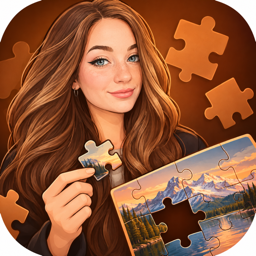
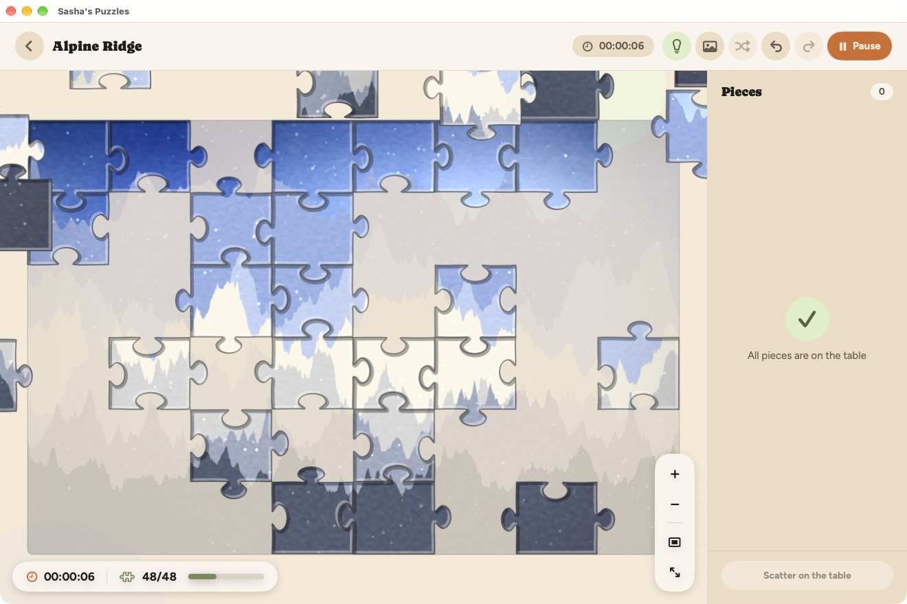
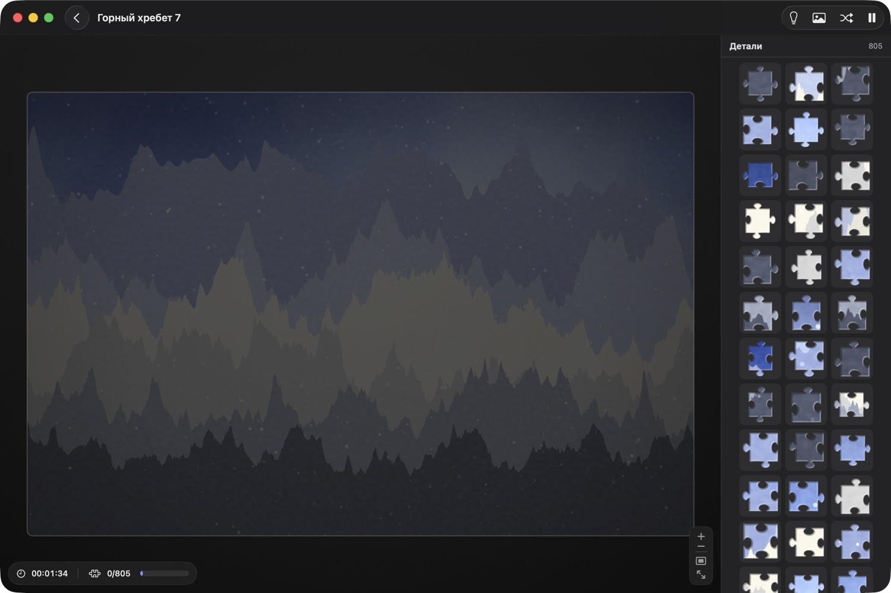
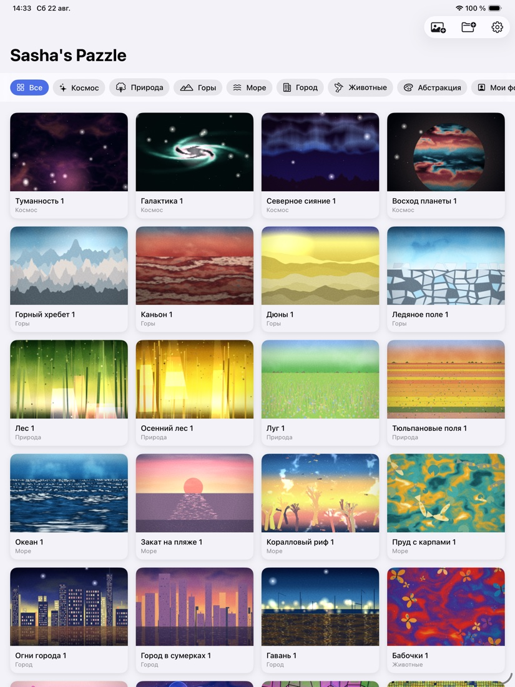
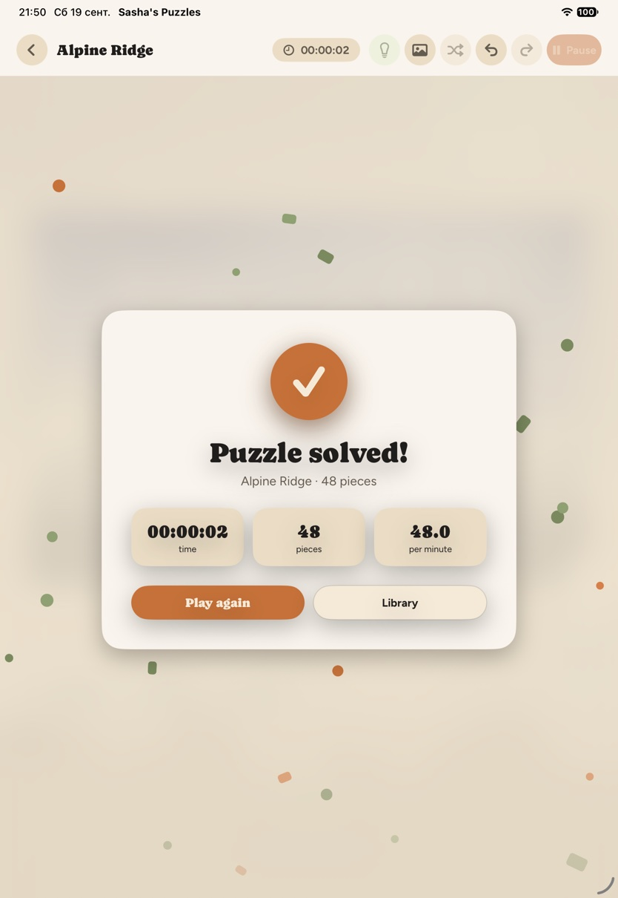
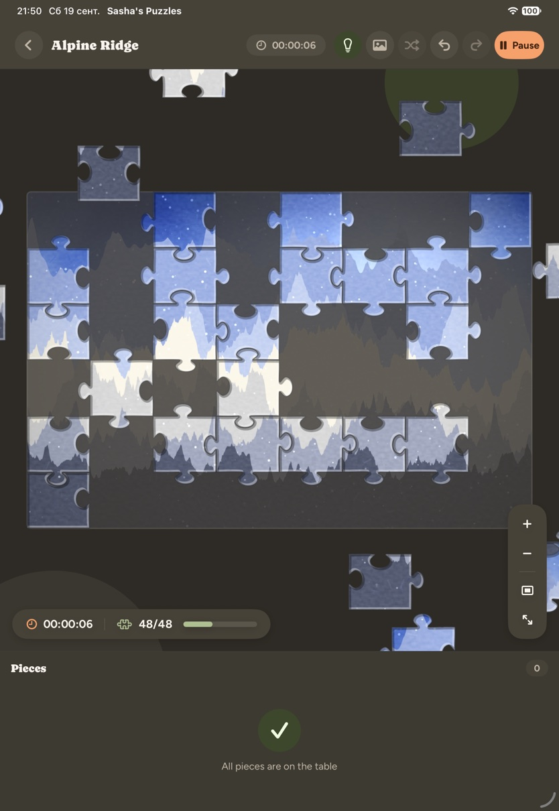
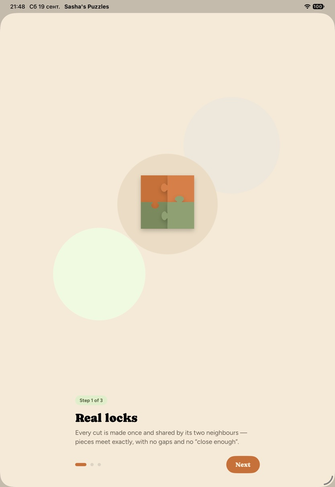
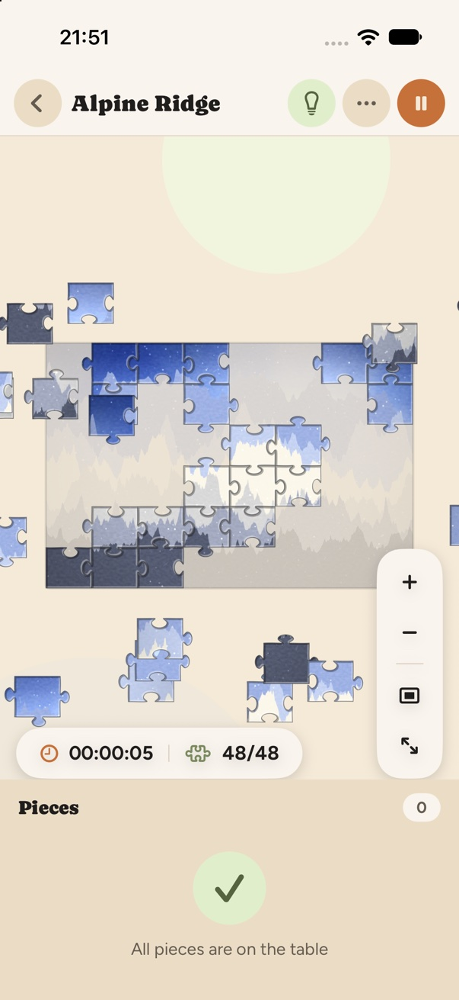

<p align="center">
  
</p>

<h1 align="center">Sasha's Puzzles</h1>

<p align="center">
  A native Apple jigsaw puzzle for <b>macOS, iPadOS and iOS</b>, written in Swift 6 and SwiftUI.<br>
  Real interlocking piece geometry, real drag-and-drop, real groups —<br>
  from a 12-piece warm-up to an 800-piece project, with a daily puzzle,
  streaks and achievements.
</p>

<p align="center">
  
  
  
  
  
  
</p>

<p align="center">
  <b>120 built-in photographs · 12 – 1000 pieces · no web view, no backend, no network access of any kind</b>
</p>

The Xcode target, scheme and Swift module stay `JigsawPuzzle`; only the name the
app shows on screen is *Sasha's Puzzles*.

---

## Screenshots

<p align="center">
  
</p>

<p align="center">
  <em>macOS — connected pieces become a group and move as one; the faint guide
  underneath can be switched off</em>
</p>

<table>
<tr>
<td width="58%"></td>
<td width="42%"></td>
</tr>
<tr>
<td align="center"><em>Nightmare mode — 805 pieces, cut in a tenth of a second</em></td>
<td align="center"><em>The library: today's puzzle and its streak, 120 built-in
pictures plus your own photos, best times on solved cards</em></td>
</tr>
</table>

<table>
<tr>
<td width="33%"></td>
<td width="33%"></td>
<td width="33%"></td>
</tr>
<tr>
<td align="center"><em>Solved — time, record delta, pace, confetti and any
achievement just unlocked</em></td>
<td align="center"><em>Dark appearance, same warm palette</em></td>
<td align="center"><em>Three-step onboarding on first launch</em></td>
</tr>
</table>

<p align="center">
  
</p>

<p align="center">
  <em>iPhone — board on top, tray along the bottom, actions collapsed into a menu</em>
</p>

### Design

The look follows the *Organic* design system: cream and sand surfaces
(`#f5ead8` / `#ebddc5`), a terracotta accent (`#c67139`) for the primary action,
sage (`#7a8a5e`) for everything that says "done", pill-shaped controls and
over-rounded cards. Headings are set in **Caprasimo**, body text in **Figtree**
(both bundled, SIL Open Font License). Neither font has Cyrillic or CJK glyphs,
so those localisations fall back to SF Rounded and SF through a CoreText
cascade list rather than to a different weight. Every colour is a dynamic token in
`Theme.swift`, so light and dark are one set of views.

---

## Requirements

| | |
|---|---|
| Xcode | 16.0 or newer (developed on **Xcode 26.6**) |
| Swift | 6.0 language mode (toolchain **Swift 6.3**) |
| macOS | 15.0 or newer, up to and including **macOS 27 Golden Gate** |
| iOS / iPadOS | 18.0 or newer, up to and including **iOS / iPadOS 27** |
| Architecture | Apple Silicon and Intel |
| Dependencies | **none** — no SPM packages, no CocoaPods, no Carthage |

The deployment targets stay at macOS 15 / iOS 18: nothing in the 27 SDKs is
required to build or run. Submitting to the App Store does need Xcode 27, which
also opts the app into the current Liquid Glass appearance. `CLAUDE.md` records
what the 27 SDKs change for this code.

## Running it

```bash
open JigsawPuzzle.xcodeproj
```

Pick the **JigsawPuzzle** scheme, choose *My Mac* (or a simulator) and press ⌘R.

From the command line:

```bash
xcodebuild -project JigsawPuzzle.xcodeproj -scheme JigsawPuzzle -destination 'platform=macOS,arch=arm64' build
```

### Installing it as a normal Mac app

To get an icon you can double-click instead of launching from Xcode every time:

```bash
./Scripts/install-mac.sh                 # onto the Desktop
./Scripts/install-mac.sh /Applications   # into Launchpad and Spotlight
```

That builds the Release configuration — noticeably faster than Debug — and
copies the bundle out of
`DerivedData`. The bundle identifier does not change, so saved games and
imported photos carry over. Re-run the script after any change to refresh the
installed copy.

The macOS build is signed ad-hoc, which is enough to run on the machine that
built it. Sharing that `.app` with someone else needs a Developer ID certificate
and notarisation.

```bash
xcodebuild -project JigsawPuzzle.xcodeproj -scheme JigsawPuzzle -destination 'platform=macOS,arch=arm64' test
```

```bash
xcodebuild -project JigsawPuzzle.xcodeproj -scheme JigsawPuzzle -destination 'platform=iOS Simulator,name=iPhone 17 Pro' test
```

### Installing on a physical iPhone or iPad

The project deliberately ships **no signing credentials**. To run on your own
device:

1. Open the project in Xcode.
2. Select the **JigsawPuzzle** target → *Signing & Capabilities*.
3. Set **Team** to your Apple ID / Apple Developer team.
4. Change **Bundle Identifier** to something unique to you — App IDs are global,
   so a placeholder like `com.example.*` will usually be refused.
5. Select your device and press ⌘R. On the device, trust the developer
   certificate under *Settings → General → VPN & Device Management*.

   With a free Apple ID the build expires after **7 days** and at most three
   such apps can be installed at once; a paid Apple Developer Program membership
   raises that to a year.

The macOS build is signed ad-hoc (`Sign to Run Locally`) and needs no team.

---

## The puzzle engine

### Shared edges

The heart of the app is that **every interior cut exists exactly once**:

```
horizontalCuts[row * columns + column]   // between (row, col) and (row+1, col)
verticalCuts[row * (columns-1) + column] // between (row, col) and (row, col+1)
```

A piece's outline reuses those very curves, reversing the two it walks
backwards. `EdgeCurve.reversed` mirrors control points within each cubic segment
and flips the chain order, which is an *exact* operation — so

```
A.right ≡ inverse(B.left)     A.bottom ≡ inverse(C.top)
```

holds by construction rather than by tolerance. There is no matching pass and no
possibility of drift, gaps or overlaps. `GeometryTests` asserts it for every
neighbouring pair, sample by sample, at 1e-9.

### Edge shape

Each cut is a five-segment cubic Bézier profile defined in a normalised frame
from `(0,0)` to `(1,0)`:

```
               ___
              /   \      head  (half-width b, apex ≈ 1.03·h)
             |     |
  ___________\     /__________   neck  (half-width w < b → undercut)
  ^ baseline, gently bowed
```

Randomised per edge — position, neck and head width, height, skew, baseline bow —
from a seed derived by hashing `(puzzleSeed, kind, row, column)`. Tabs are sized
from the *smaller* cell dimension so they stay in proportion on any grid. Tests
check the outlines are closed, tab-bearing on interior edges, perfectly flat on
the border, and free of self-intersections.

### Board units

The engine works in **board units**, a space whose area is always 1 000 000
(1000 × 1000 for a square picture). Window size, zoom and orientation never touch
these numbers — they only change the `Viewport` transform. Resizing a window or
rotating a device is a pure re-layout: nothing is recomputed, nothing is lost.

### Groups

A connected cluster is described by a **single translation**, since its members
are by definition in their exact solved relationship. That yields one crisp
invariant:

> two pieces are correctly joined **iff their groups share the same translation**

Everything falls out of it. Snapping = find the nearest candidate translation
(a touching group's, or `.zero` for the board itself) within tolerance. Merging =
breadth-first absorption of every touching group that now matches, so a piece
dropped into a hole joins all four neighbours at once. Moving a group is O(1) and
can never split it. A group whose translation is `.zero` sits in its solved
position and is **locked** — it cannot be dragged or sent back to the tray, so the
finished part of the picture stays put. Completion = one group left.

Snap tolerance scales with both piece size and zoom, and is clamped below half a
cell so a piece can never grab the wrong slot.

---

## Performance

An 800-piece board is the design target, not an afterthought.

| Stage | Release | Debug (`-Onone`) |
|---|---|---|
| Build 35 × 23 geometry | < 0.01 s | < 0.01 s |
| Cut 805 piece bitmaps | 0.05 s | 0.05 s |

Measured on an Apple Silicon Mac. What makes it work:

* **Pre-rendered piece bitmaps.** Clipping 800 Bézier outlines against a
  photograph every frame is hopeless; doing it once per piece and blitting the
  cached bitmap turns the draw loop into textured rectangles. Cutting is spread
  across all cores and chunked so it reports progress and can be cancelled.
* **Cropped source fragments.** Each piece draws a `CGImage.cropping` view of the
  source rather than the whole picture under a clip — cropping is free, drawing
  is not.
* **A texture budget.** `PieceTextureStore.affordableScale` lowers the pixel
  scale rather than risking a memory-pressure termination, and re-cuts only when
  zoom changes by more than 25 %, debounced.
* **Culling and a cached draw order.** Off-screen pieces are skipped; the
  back-to-front order is recomputed only when the *structure* changes, never
  during a drag.
* **Downsampled decoding.** Imported photos are never fully materialised — the
  longest edge is capped at 4096 px on import and decoded through ImageIO
  thumbnails thereafter.

---

## The picture library

The built-in library is **120 photographs from Unsplash** (Unsplash License,
credits in [`docs/photo-credits.md`](docs/photo-credits.md)), 2560 px on the
long side, across space, mountains, nature, sea, city, animals and abstract.
They live in `Sources/Resources/Pictures/` as `<category>_<Title>.jpg`; the
title is a string-catalog key translated into all ten languages.

Pictures are decoded lazily at the size actually needed and cached in memory
(LRU) and on disk, so opening one twice is a small decode rather than a full one.

**Your own photos** are imported through `PhotosPicker` (multi-select) or from
Files, copied as optimised JPEGs into the app container, indexed by a small JSON
manifest, and can be renamed or deleted. Copies rather than references, so a
puzzle keeps working after the original leaves your library.

---

## Persistence

* **Saved games** — one JSON document, written atomically, holding the picture
  reference, difficulty, elapsed time, every group and its translation, and the
  completion flag. Geometry is *not* stored: `seed`, `columns` and `rows`
  regenerate the identical Bézier cut, which keeps an 800-piece save small.
* **Autosave** — debounced two seconds after any change, plus immediately on
  pause, on leaving the foreground and on closing the board.
* **Photo library** — a JSON manifest next to a folder of JPEGs, both inside the
  app container. Entries whose file has vanished are dropped on load.
* **Statistics** — one JSON array of finished games (picture, category, pieces,
  time, date). Totals, best times, the daily streak, the 12-week chart and all
  14 achievements are *derived* from it on read, so there is nothing to keep in
  sync and nothing to migrate. A game counts as the daily puzzle when it is that
  day's picture at the daily piece count.

Nothing leaves the device. There is no account, no server and no analytics.

---

## Architecture

```
Sources/
├── App/          JigsawPuzzleApp, AppModel, RootView, menu commands
├── Model/        Difficulty, PuzzleAspect, LibraryItem, categories
├── Engine/       EdgeProfile · PuzzleGeometry · PuzzleState   ← pure, testable, Sendable
├── Render/       PieceTextureStore (parallel bitmap cutting + bevel)
├── Interaction/  Viewport, BoardEventView (AppKit/UIKit input bridge)
├── Library/      ImagePipeline, ImageStore, PhotoLibraryStore, HomeView, ProfileView
├── Game/         GameSession, BoardView, TrayView, SetupView, overlays
├── Settings/     AppSettings, SettingsView
├── Persistence/  GameSnapshot, SaveStore, PlayerStats (achievements, streaks)
├── Support/      Theme (tokens, fonts, controls), SplitMix64, Feedback, debug driver
└── Resources/    Assets.xcassets, Localizable.xcstrings, Fonts/
Tests/            66 tests across 8 suites
```

The engine layer (`Engine/`) is `nonisolated` and `Sendable` and knows
nothing about SwiftUI, which is what lets it be unit-tested directly and rendered
on background threads. The project uses Swift 6 strict concurrency with
`MainActor` default isolation.

### Input

Drawing is declarative (a single SwiftUI `Canvas`); **input is native**. A thin
`NSView` / `UIView` sits over the board and provides an unambiguous gesture
contract:

| | |
|---|---|
| Mac | drag a piece with the mouse; drag empty table to pan; scroll to pan; ⌘-scroll or trackpad pinch to zoom; right-click a piece to return it to the tray |
| iPad / iPhone | one finger (or Apple Pencil) moves a piece, or pans when it starts on empty table; two fingers pan; pinch zooms |

Overlapping SwiftUI gestures were rejected in favour of real gesture recognisers
because stability of the core mechanic matters more than uniformity.

### Layout

| | |
|---|---|
| Mac | board fills the window, piece tray docked on the trailing edge |
| iPad landscape | board left, tray right |
| iPad portrait / iPhone | board on top, tray along the bottom |

The layout follows the window's shape, so Split View, Stage Manager and window
resizing are handled by the same code path as rotation.

---

## Features

- 120 built-in photographs + your own photos (Photos and Files import)
- Difficulty from 12 to 800 pieces, plus a custom slider up to 1000
- Framing: original, 1:1, 3:2, 4:3, 16:9, 2:3 — centre-cropped, never stretched
- True jigsaw geometry with tabs, sockets and flat borders
- Snap, green connection flash, group forming and group merging; a cluster
  that reaches its solved position locks in place
- Pan and zoom with fit-board / fit-table shortcuts
- Elapsed-time clock that stops on pause and in the background
- Pause, hint, show original, scatter-all, undo / redo
- Autosave and *Continue* from the library
- A daily puzzle (150 pieces, one picture per day) with a streak counter
- Profile: puzzles solved, pieces placed, time at the table, a 12-week chart
  and 14 achievements; best time on every solved card
- Completion screen with confetti, the delta to your previous record and any
  achievement just unlocked
- Three-step onboarding on first launch
- Settings: theme, sounds, background music, haptics, picture guide, piece
  outlines, snap assist, defaults, reset saves and statistics
- Sound and haptics for snap, merge and completion — synthesised by default,
  replaced by any `snap`/`merge`/`complete` audio file dropped into
  `Sources/Resources/Sounds/`; a `music.*` there loops while the board is open
- Photographs dropped into `Sources/Resources/Pictures/` as
  `<category>_<Title>.jpg` join the library, no code changes
- Full keyboard-shortcut menu bar on macOS
- Ten languages (English, Russian, German, French, Spanish, Italian,
  Brazilian Portuguese, Japanese, Korean, Simplified Chinese), Dynamic Type,
  VoiceOver labels, light and dark
- `docs/app-store.md` — release checklist, screenshot script
- `docs/store-listing.md` — App Store copy in all 10 languages

## Tests

`Tests/` contains **66 tests in 8 suites** (Swift Testing), covering the areas the
engine cannot be allowed to get wrong:

grid selection · edge generation · edge matching between neighbours · flat
borders · closed, non-self-intersecting outlines · determinism from a seed ·
coordinates · snap calculation and tolerance scaling · group merge · four-way
bridging · group movement · completion detection · shuffle · scatter · the real
clock · undo/redo · save/load and serialisation · image crop, resize and decode ·
texture rendering and the memory budget ·
photo import, reload and deletion · viewport mapping, anchored zoom and the
resize clamp · daily streaks, achievement unlocks and completion summaries.

```bash
xcodebuild -project JigsawPuzzle.xcodeproj -scheme JigsawPuzzle \
  -destination 'platform=macOS,arch=arm64' test
```

### Visual verification

`DebugStageDriver` (debug builds only) drives the app into a named state at
launch so screens can be photographed reproducibly:

```bash
open -n "/path/to/Sasha's Puzzles.app" --args --stage huge --clear-saves
```

Add `-AppleLanguages "(en)" -onboarding YES -appearance light` to fix the
language, skip the first-run onboarding and pin the appearance.

Stages: `library`, `dark`, `settings`, `setup`, `board`, `scattered`, `snapped`,
`hint`, `completed`, `huge`, `hugeSolved`. `--tray-trailing` forces the
landscape layout on a portrait simulator.

## Known limitations

- Pieces cannot be rotated. Every difficulty assumes the classic
  upright-pieces rule.
- Above roughly 1000 pieces the tray becomes an impractical way to play; use
  *Scatter Pieces*. The engine itself has no hard limit.
- At very high zoom the piece bitmaps are re-cut on a debounce, so there is a
  brief moment of softness while the sharper set is produced.
- Verified on macOS and in the iPhone/iPad simulators. **No physical iPhone or
  iPad was available**, so on-device behaviour — including Apple Pencil — is
  untested on real hardware.
- Sound is synthesised additively at launch unless audio files are bundled; if
  the audio engine fails to start the app runs silently rather than reporting
  an error.

## Licence

Sample project — no warranty. Replace the bundle identifier with your own before
distributing.
